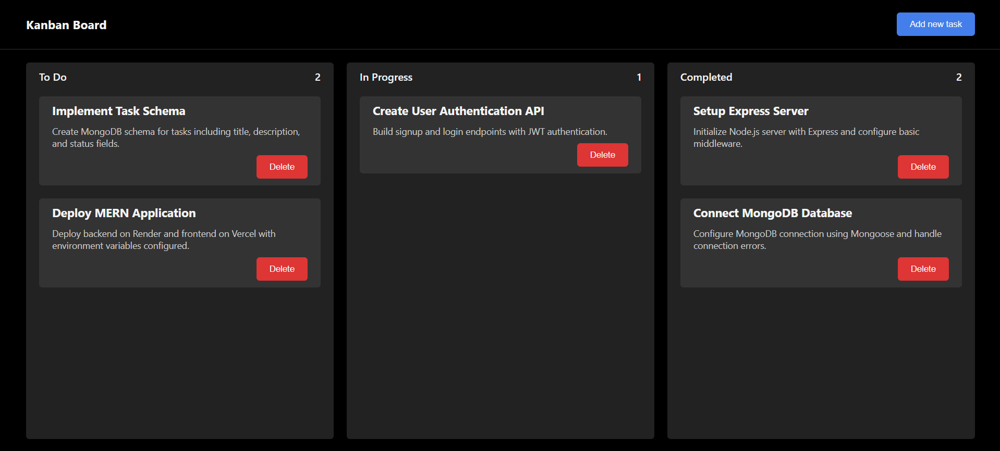

# Kanban Board

A simple, interactive Kanban Board web application built with HTML, SCSS, and JavaScript. Organize your tasks into columns (To Do, In Progress, Completed), drag and drop tasks between columns, and persist your tasks using localStorage.

## Screenshots

Preview:




## Features

| Feature           | Description |
|-------------------|-------------|
| Add Tasks         | Add tasks with a title and description. |
| Drag & Drop       | Move tasks between columns easily. |
| Delete Tasks      | Remove tasks with a single click. |
| Task Counts       | See the number of tasks in each column. |
| Persistent Board  | Tasks are saved in your browser. |
| Responsive Design | Works on desktop and mobile. |

---


## Getting Started

To get started with the Kanban Board:

1. **Clone the repository:**
	```bash
	git clone https://github.com/mannatgupta146/Kanban-Board.git
	```
2. **Navigate to the project folder and open `index.html` in your browser.**

No build steps or dependencies are required. Everything runs locally in your browser!


## Project Structure

```
index.html   - Main HTML file
style.scss   - Main SCSS file (source)
style.css    - Compiled CSS file
script.js    - Main JavaScript file
```

Each file is self-contained and easy to modify. Edit `style.scss` for custom styles and `script.js` for logic changes.


## Customization

- **Styling:** Edit `style.scss` and recompile to `style.css` for custom colors, spacing, or layout.
- **Functionality:** Modify `script.js` to add new features, change drag-and-drop logic, or integrate with other tools.
- **HTML:** Update `index.html` to change the board layout or add new UI elements.

No frameworks or build tools are required—just edit and refresh!


## Contributions

Contributions are welcome! If you have suggestions, bug reports, or want to add new features, please:

1. Fork the repository on GitHub.
2. Create a new branch for your feature or fix.
3. Submit a pull request with a clear description of your changes.

You can also open issues for bugs or feature requests. All contributions are appreciated!


## Support

If you encounter any issues, have questions, or need help, please open an issue on the [GitHub repository](https://github.com/mannatgupta146/Kanban-Board.git).

You can also check the repository for updates and documentation.


---

*This project is for educational and personal use. Feel free to modify and enhance it for your needs!*
